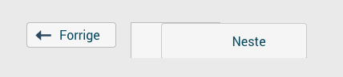

#January 8th 2018

In the MatematikkMOOC design, we have moved the previous/next buttons on the course pages to the lower middle of the page. 
At some point late 2017, Canvas changed something which caused the previous/next buttons to look like this with our design.

	    

##The relevant HTML code before the change:

Previous button:

```
      <a href="https://kurs.iktsenteret.no/courses/48/modules/items/1126" role="button" class="Button module-sequence-footer-button--previous" data-html-tooltip-title="<i class='icon-document'></i> 1.3 Hvordan gjennomføre kurset?" aria-describedby="msf0-previous-desc">
        <i class="icon-mini-arrow-left"></i>Forrige
        <span id="msf0-previous-desc" class="hidden" hidden="">Forrige: 1.3 Hvordan gjennomføre kurset?</span>
      </a>
```    

Next button:

```    
      <a href="https://kurs.iktsenteret.no/courses/48/modules/items/1128" role="button" class="Button module-sequence-footer-button--next" data-html-tooltip-title="<i class='icon-document'></i> 1.5 Bruk av symboler" aria-describedby="msf0-next-desc ui-tooltip-0">
        Neste<i class="icon-mini-arrow-right"></i>
        <span id="msf0-next-desc" class="hidden" hidden="">Neste: 1.5 Bruk av symboler</span>
      </a>
```

##After the change

Previous button:

```
      <a href="https://ikt.instructure.com/courses/88/modules/items/1180" role="button" class="Button module-sequence-footer-button--previous" data-tooltip="right" data-html-tooltip-title="<i class='icon-document'></i> Hva skjer nå?" aria-describedby="msf0-previous-desc">
        <i class="icon-mini-arrow-left"></i>Forrige
        <span id="msf0-previous-desc" class="hidden" hidden="">Forrige: Hva skjer nå?</span>
      </a>
```
    
Next button:

```
      <span class="module-sequence-footer-button--next" data-html-tooltip-title="<i class='icon-document'></i> Semesterregistrer deg" aria-describedby="ui-tooltip-1">
        <a href="https://ikt.instructure.com/courses/88/modules/items/1182" role="button" class="Button" aria-describedby="msf0-next-desc">
          Neste<i class="icon-mini-arrow-right"></i>
          <span id="msf0-next-desc" class="hidden" hidden="">Neste: Semesterregistrer deg</span>
        </a>
      </span>
```

Notice that in the latest version, the next button is embedded in a `span` element, and that the class `module-sequence-footer-button--next` has been moved from the `a` element into the `span` element. 
This causes the CSS selector to not match the element any longer.
The fix was to update the right button selector everywhere from 

```
            .module-sequence-footer-button--next {
```

to

```
            .module-sequence-footer-button--next a {
```


